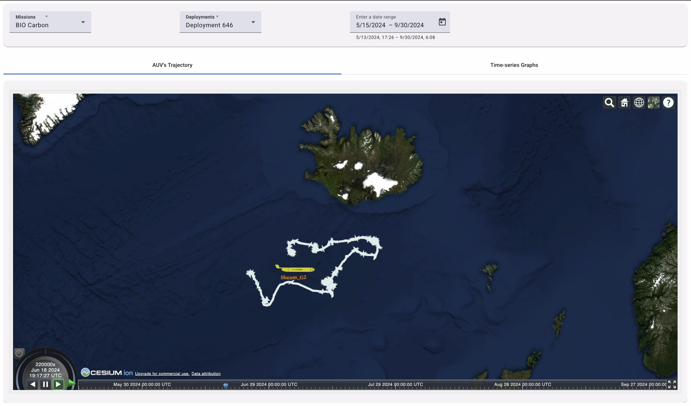
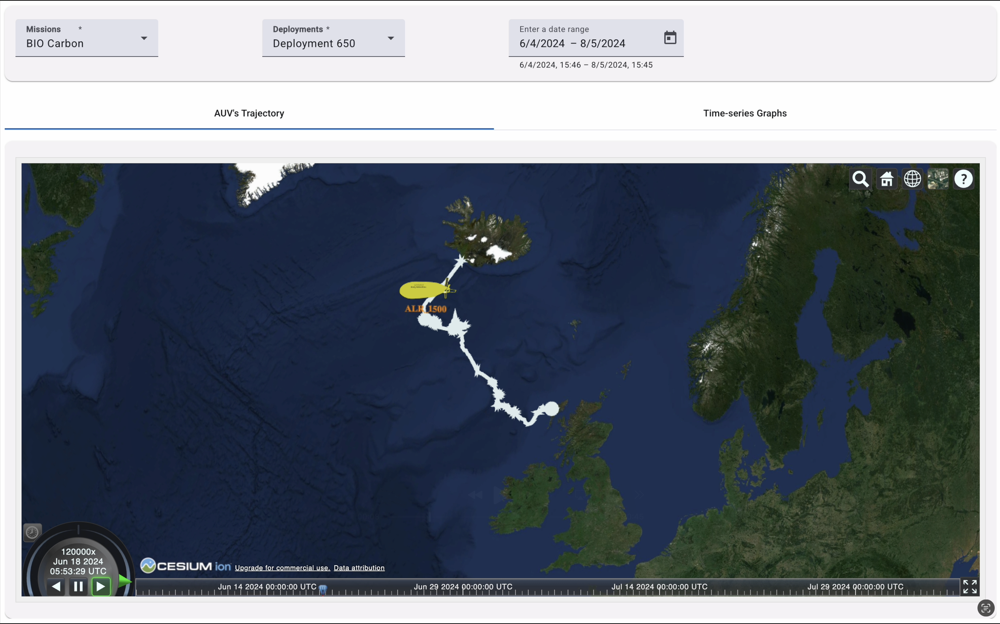
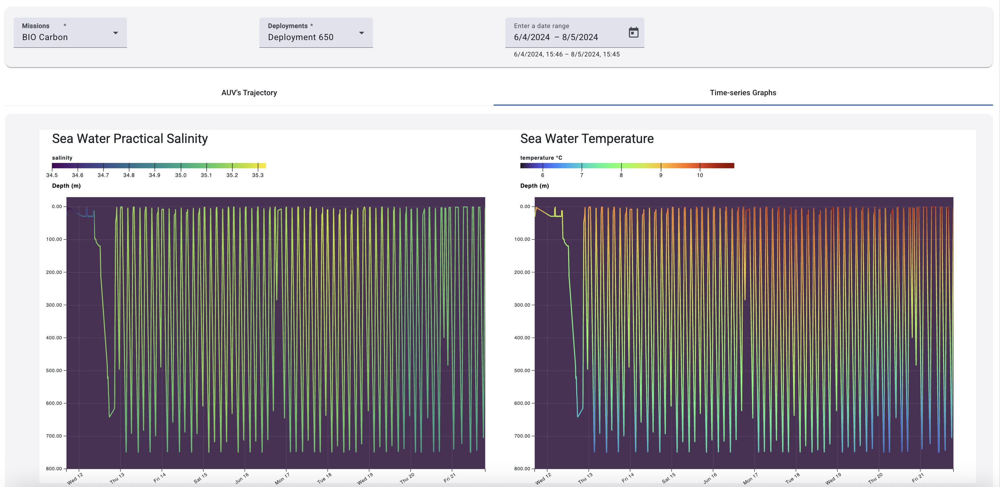
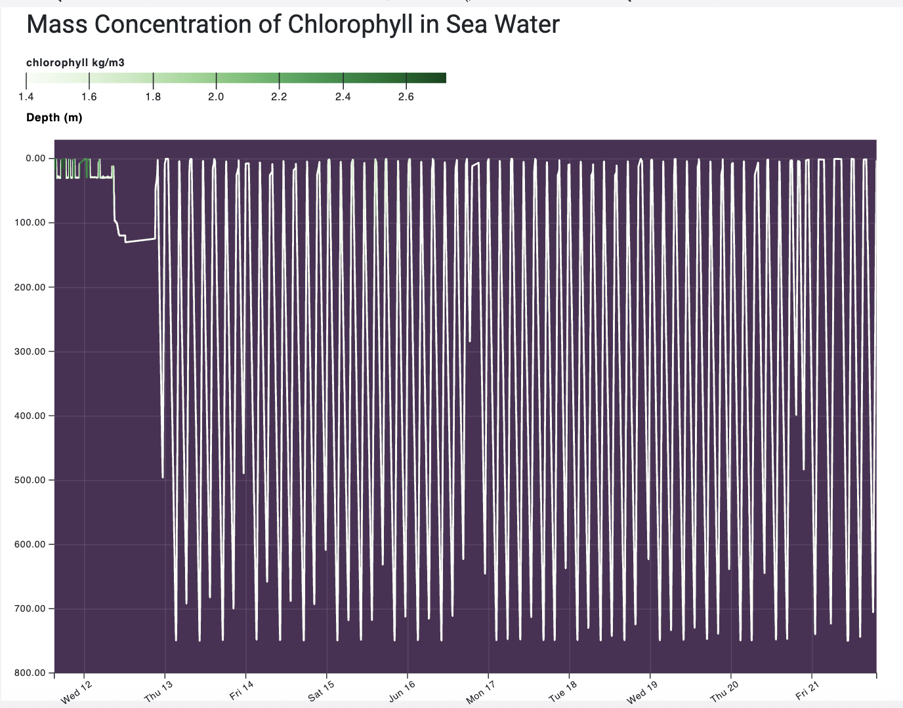

# MAMMA MIA Visualisation

**MAMMA MIA** (Marine Autonomy Modelling: Merging observAtions and siMulations for Interoperable Applications) Visualisation is a modern web-based geospatial and oceanographic data visualization application built with **Angular 18** and **CesiumJS**. It enables researchers, mission operators, and marine scientists to simulate, and analyze autonomous underwater vehicle (AUV) missions in 3D and 4D environments with synchronized physical and chemical ocean telemetry.

## Features
### Deployment trajectory visualisation
BIO Carbon deployment 646 using a Slocum Glider



BIO Carbon deployment 650 using an Autosub Long Range



### Time series of oceanographic data

Time series of salinity and temperature from the BIO Carbon deployment 650



Time series of chlorophyll from the BIO Carbon deployment 650



## Important Links
- [MAMMA MIA Visualization Documentation](https://noc-oi.github.io/mamma-mia-vis/)
- [MAMMA MIA Toolbox Documentation ](https://noc-mdp.github.io/MammaMia/)

##  Dependencies

### Frontend dependencies
```
- Node.js>=`18.x` or `20.x` (LTS recommended)
- npm>=`9.x` or higher (comes bundled with Node.js)
- Cesium Ion Access Token: An active token from [Cesium Ion](https://ion.cesium.com/) for bathymetric terrain and geocoding services.
- Angular>=`18.2.0`
- Angular material>=`18.2.12`
- bootstrap>=`5.3.3`
- d3>=`7.9.0`
- date-fns>=`4.1.0`
- express>=`4.18.2`
- rxjs>=`7.8.0`
- tslib>=`2.3.0`
- zone.js>=`0.14.10`
```

### Documentation dependencies 
```
- mkdocs: Version `1.6.0`
- mkdocs-material: Version `9.5.0`
- pymdown-extensions: Version `11.0.2`
```

See the [installation guide](https://noc-oi.github.io/mamma-mia-vis/getting-started/) for more information.
