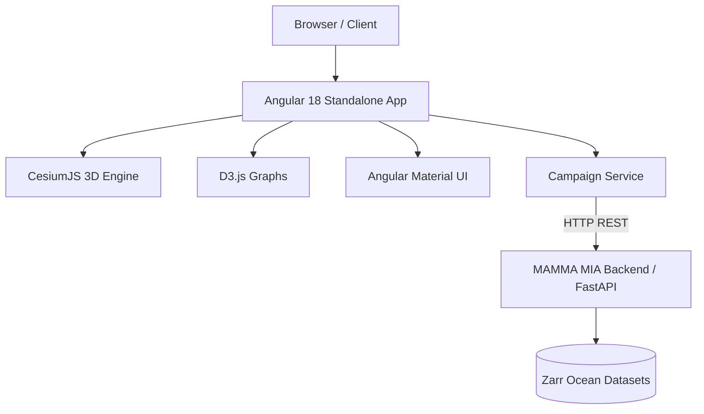

# MAMMA MIA Visualisation

Welcome to the **MAMMA MIA Visualisation** platform documentation.

**MAMMA MIA** (Marine Autonomy Modelling: Merging observAtions and siMulations for Interoperable Applications) Visualisation is a modern web-based geospatial and oceanographic data visualization application built with **Angular 18** and **CesiumJS**. It enables researchers, mission operators, and marine scientists to simulate, and analyze autonomous underwater vehicle (AUV) missions in 3D and 4D environments with synchronized physical and chemical ocean telemetry.

---

## Key Features

### 3D Globe & Ocean Bathymetry
- **CesiumJS 3D Geospatial Engine**: Interactive 3D digital globe rendering realistic ocean bathymetry using `createWorldBathymetryAsync`.
- **Lighting & Atmospheric Simulation**: Directional lighting and dynamic sky atmosphere for realistic mission playback.

### AUV Trajectory Tracking & Simulation
- **4D Mission Playback**: Historical vehicle trajectory animation streamed via **CZML** (Cesium Language) data sources.
- **2D Vehicle Models**: 2D vehicle models rendered as SVGs.
- **Temporal & Spatial Queries**: Interactive date range filters to isolate specific dive profiles and mission legs.

### Synchronized Oceanographic Telemetry
- **Multi-Variable Time-Series Graphs**: Built with **D3.js** for high-precision sensor data plotting.
- **Ocean Physical & Biogeochemical Variables**:
    - **Pressure**: Sea water pressure (dbar / relative to sea surface).
    - **Salinity**: Practical salinity (PSU).
    - **Temperature**: In-situ sea water temperature (°C).
    - **Chlorophyll**: Mass concentration of chlorophyll-a in sea water ($\mu g/L$).
- **Coordinated Interaction**: Cursor scrubbing and time synchronization between 3D vehicle spatial position and time-series telemetry plots.

### Campaign & Mission Support
- **Preconfigured Ocean Campaigns**:
    - **BIO-Carbon**: Support for multiple glider/AUV deployments (`Deployment_645`, `Deployment_646`, `Deployment_648`, `Deployment_649`, `Deployment_650`).
    - **RAPID Array**: Virtual mooring and array surveillance (`RAD24_01`).
- **RESTful Zarr Backend**: Decoupled architecture communicating with the FastAPI backend that streams data directly from multidimensional Zarr stores.

---

## Technology Stack



| Layer | Technologies | Description |
| :--- | :--- | :--- |
| **Framework** | Angular 18 (Standalone Components) | Application framework using standalone architecture, RxJS reactive programming, and Angular Router. |
| **3D Visualization** | CesiumJS, CZML, SVG | 3D virtual globe, bathymetric terrain rendering, camera animation, and 4D trajectory modeling. |
| **Data Visualization**| D3.js, `date-fns` | Responsive line charts, interactive legends, and time-scale adapters for sensor readings. |
| **UI Components** | Angular Material, Bootstrap 5, SCSS | UI controls (sliders, date pickers, select dropdowns, tabs) and styling. |
| **Build System** | Webpack 5, `@ngtools/webpack` | Custom Webpack pipeline for Angular Ahead-of-Time (AOT) compilation and Cesium static asset management. |
| **Data Backend** | FastAPI, Zarr | Companion backend providing trajectory points, sensor metrics, and deployment metadata. |

---

## Project Structure

```
mamma-mia-vis/
├── docs/                      # MkDocs documentation source files
│   ├── index.md               # Documentation homepage
│   └── getting-started.md     # Setup, build, and run instructions
├── mkdocs.yml                 # MkDocs configuration file
├── src/
│   ├── app/
│   │   ├── core/              # Core layout components (Header, Nav)
│   │   ├── graphs/            # D3.js time-series & legend components
│   │   │   ├── chart-legend/  # Custom chart legends
│   │   │   └── line-chart/    # Reusable line chart component
│   │   ├── pages/
│   │   │   └── visualisation/ # Main 3D Cesium & telemetry dashboard
│   │   ├── services/          # Services for API, state, and configuration
│   │   │   ├── animation-state.service.ts
│   │   │   ├── campaign.interface.ts
│   │   │   ├── campaign.service.ts
│   │   │   └── config.service.ts
│   │   ├── app.routes.ts      # Client-side routing configuration
│   │   └── app.config.ts      # Application providers and config
│   ├── assets/
│   │   └── config.json        # Environment endpoints and API paths
│   └── styles.scss            # Global styles and Bootstrap theme overrides
├── Dockerfile                 # Multi-stage Docker containerization
├── nginx.conf                 # Production Nginx reverse proxy configuration
├── package.json               # Node dependencies and project scripts
├── tsconfig.json              # TypeScript compilation settings
└── webpack.config.js          # Webpack 5 bundling and Cesium configuration
```

---

## Next Steps

To set up the project locally, configure environment variables, and run both the Angular development server and the documentation:

👉 **[Go to Getting Started](getting-started.md)**
